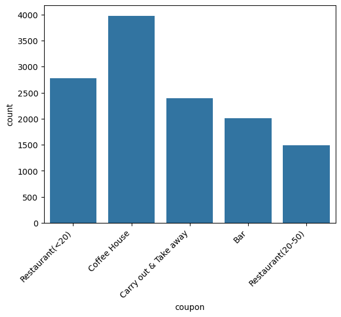
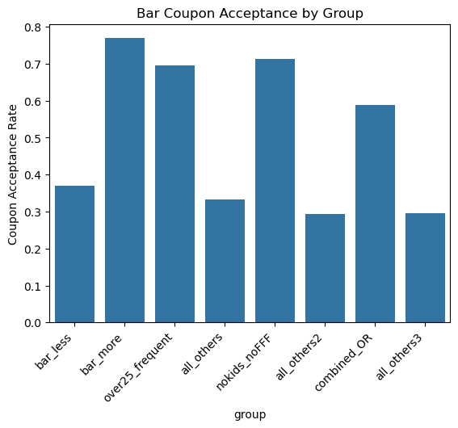
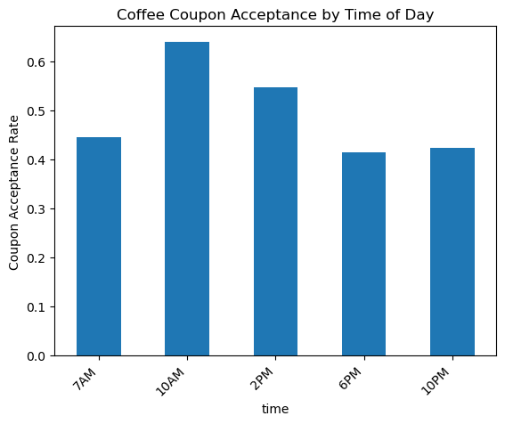
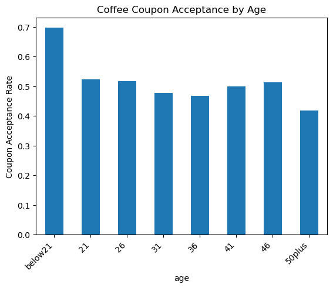
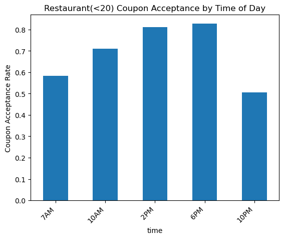
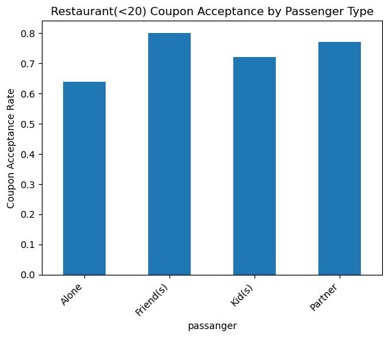
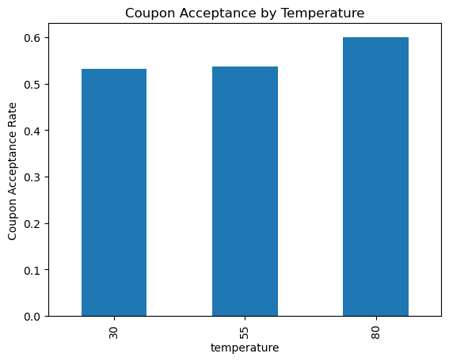

# coupon_acceptance_analysis

# Will the Customer Accept the Coupon?

Exploratory data analysis of the UCI in-vehicle coupon recommendation dataset, examining what factors predict whether a driver accepts a mobile coupon while driving.

See [FINDINGS.md](FINDINGS.md) for key findings and actionable recommendations.

## Overview

This dataset comes from a survey conducted via Amazon Mechanical Turk, describing driving scenarios (destination, weather, time of day, passenger, coupon type) and whether the respondent said they would accept the coupon. This analysis explores overall acceptance patterns, then dives deeper into three coupon types (**Bar**, **Coffee House**, and **Restaurant (<$20)**) to see what drives acceptance for each.

## Data

- Source: [UCI Machine Learning Repository](https://archive.ics.uci.edu/dataset/603/in+vehicle+coupon+recommendation)
- 12,684 rows, 26 columns (before cleaning)

## Data Cleaning

- Dropped the car column (99% missing, and remaining values were too inconsistent to use)
- Dropped 42 rows missing all five visit-frequency columns (Bar, CoffeeHouse, CarryAway, RestaurantLessThan20, Restaurant20To50)
- Filled remaining missing values (~1-2% per column) with each column's mode

## Overall Findings

- 56.8% of all coupons were accepted
- Coffee House coupons were issued most often; Expensive Restaurant coupons least often
- Most scenarios occurred at 80°F, so cold-weather scenarios are underrepresented

## Bar Coupons (41% baseline acceptance)

Driven overwhelmingly by existing habit. Frequent bar-goers (>1x/month) accepted more than double the rate of infrequent visitors (77% vs. 34%), a gap that held even after controlling for age. Passenger context mattered nearly as much: even frequent bar-goers accepted far less with a kid in the car (38% vs. 71%). Age had a smaller, secondary effect (72% vs. 64%, under 30 vs. 30+).

## Coffee House Coupons (50% baseline acceptance)

Habit mattered, but less than for bars (68% vs. 45%). Time of day was a stronger driver. Acceptance peaked at 10AM (64%) and dropped by evening (41% at 6PM). Drivers under 21 accepted notably more often (70%) than any other age group (47-52%). Driving alone had the lowest acceptance (44%); driving with friends had the highest (60%), with no penalty for a child passenger.

## Cheap Restaurant (<$20) Coupons (71% baseline acceptance)

Accepted broadly regardless of habit or income (73% vs. 69% frequent vs. infrequent; no meaningful difference when combined with income). Timing and company mattered instead. Acceptance peaked around lunch and dinner (81-83% at 2PM/6PM), dropping at off-meal hours (50-58% at 7AM/10PM). Like coffee, company raised acceptance, with no penalty for a kid passenger.

## Additional Finding: Temperature

Across all coupon types combined, acceptance was similar at 30°F (53.1%) and 55°F (53.6%), but slightly higher at 80°F (60.0%). This is a modest ~7 point effect, smaller than habit or passenger-type effects, but consistent across a large sample (2,300-6,500 observations per temperature). A plausible explanation is that drivers are more willing to make a detour in nicer weather.

## Conclusion

What predicts coupon acceptance depends heavily on coupon type. Bar coupons are shaped by pre-existing habit and social appropriateness. Coffee house coupons are shaped by habit and timing. Cheap restaurant coupons are the most broadly popular of the three, driven less by who the driver is and more by when they're driving and whether they have company. This makes it a ~universal offer compared to the more targeted appeal of bar or coffee coupons. Weather has only a minor effect across all coupon types.

## Files

- `prompt_copy.ipynb` — full analysis notebook
- `coupons.csv` — dataset
- `*.png` — saved figures referenced above
